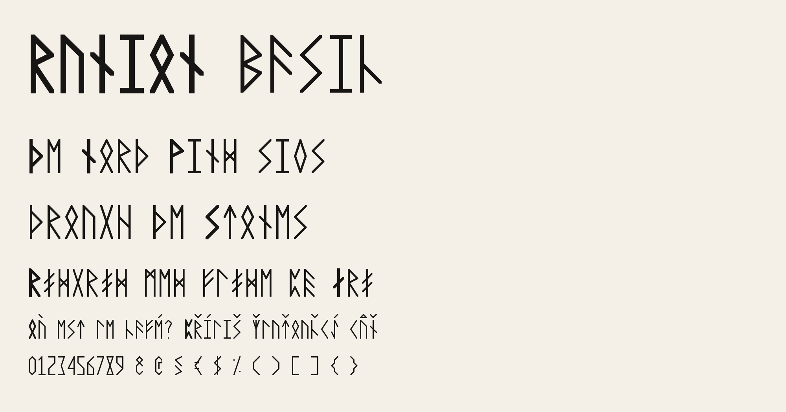
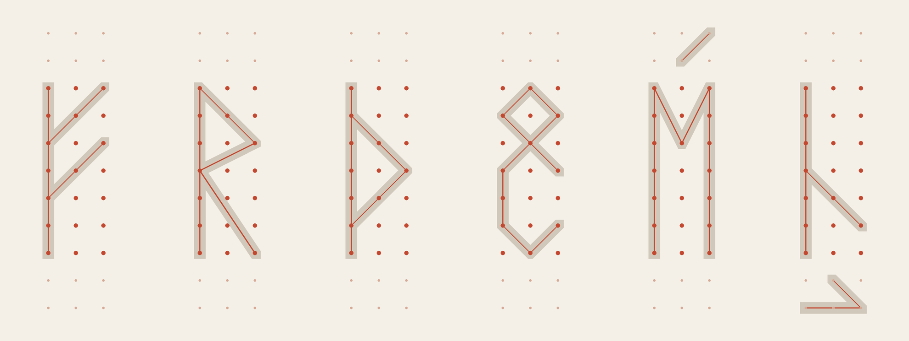
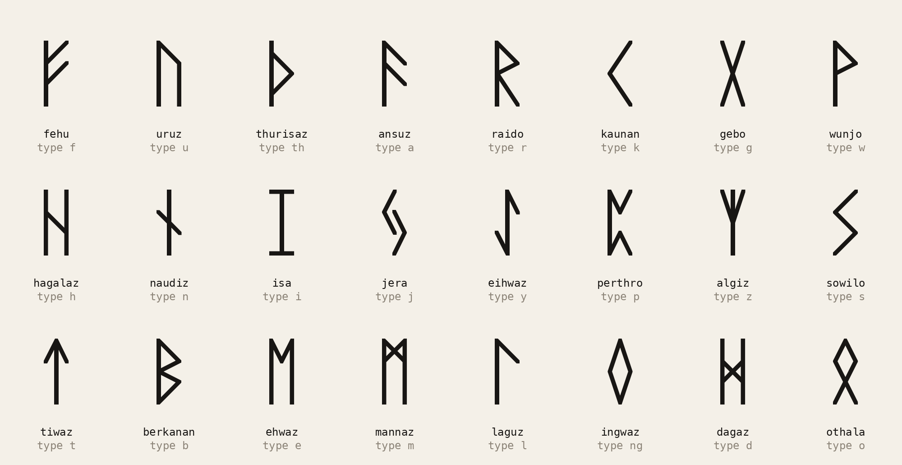

# Runion Basic

The Elder Futhark, rebuilt on a grid of 3 × 7 dots. Straight lines only, dot to dot. Monospace, narrow and tall, every letter fills the full width of a cell.



Type ordinary text and you get runes. `f` is ᚠ fehu, `u` is ᚢ uruz, and `th` becomes the single rune ᚦ thurisaz. Capitals are the same runes drawn with a heavier line. The Unicode runes (ᚠᚢᚦᚨᚱᚲ…) map to the same shapes.

To try it, open [`index.html`](index.html) or run `make serve`. The playground has a type tester, a table of every character and a sketchpad for drawing glyphs on the dots.

The font files are [`fonts/ttf/RunionBasic-Regular.ttf`](fonts/ttf/RunionBasic-Regular.ttf) and [`fonts/webfonts/RunionBasic-Regular.woff2`](fonts/webfonts/RunionBasic-Regular.woff2). The licence is the [SIL Open Font License 1.1](OFL.txt).

## The system



The font is drawn on one grid of 3 columns and 7 rows of dots. A glyph is a list of connections between dots. Fehu is `00-06 04-26 02-24`: a stave up the left side and two arms.

| Rule | What it means |
| --- | --- |
| Dot to dot | Every line starts and ends on a dot. There are no curves. |
| Full width | Every letter and digit touches both the left and the right column. |
| One stroke | One line thickness for everything (`@stroke` in the source). |
| The nib | Ink at a dot stays inside that dot's square, the nib. Corners are mitred and clipped to it, and line ends are cut flush with the grid, so every glyph has the same outer box. |
| Capitals | Not drawn separately. An uppercase letter uses the same dots and lines with a heavier pen (`@cap_stroke`). The dots don't move, so stems line up across cases. |
| Marks | Accents sit outside the rune, in two rows above and two below. Every rune fills the same box, so one mark position fits all of them. The 140 or so accented letters are composed by the build from Unicode: rune plus mark. |

All of it is defined in one text file, [`sources/glyphs.txt`](sources/glyphs.txt).

## Historical ties



The Elder Futhark is the oldest runic alphabet. It has 24 runes and was used by Germanic peoples from about the 2nd to the 8th century. The oldest securely dated inscription is the Vimose comb, from about 160 AD. The name comes from the first six runes: f, u, þ, a, r, k. The angular shapes are presumably an adaptation to cutting in wood and metal. Runion follows the same constraint.

These are not the Viking runes. The Elder Futhark belongs to the Roman Iron Age and the Migration Period, and it was already being replaced when the Viking Age began. The Vikings wrote with the Younger Futhark, which has only 16 runes, so one rune covers several sounds: ᚢ stood for u, o, v, w, y and ø, and ᚴ for k, g and ŋ. The older row of 24 fits modern text much better. Runion starts from it and borrows from later rows only where the Elder Futhark has no rune.

The rune names used here (fehu, uruz, thurisaz and the rest) are scholarly reconstructions of Proto-Germanic words, worked out from later rune poems. None of them is attested in an Elder Futhark inscription.

Some of the objects the shapes come from:

- The Kylver Stone (Gotland, Sweden, c. 400) is a slab that sealed a grave. It carries the earliest known listing of all 24 runes in order.
- The Vadstena bracteate (Sweden, c. 500) is a gold pendant. It lists the row with dots dividing it into three groups of eight, the *ættir*. It was stolen from the Swedish Museum of National Antiquities in 1938 and has not been found.
- The Golden Horns of Gallehus (Denmark, early 5th century) carried one of the earliest full sentences in runes, *ek hlewagastiz holtijaz horna tawido*: "I Hlewagastiz Holtijaz made the horn". The horns were stolen in 1802 and melted down for the gold.
- Codex Runicus (c. 1300) is a law book, the Scanian Law, written entirely in medieval runes. Runes were still a working script long after the Viking Age.

Later rune rows fill the gaps the Elder Futhark leaves for modern text. The Younger Futhark of the Viking Age cut the row to 16 runes. Towards the end of the Viking Age carvers started adding stung runes, a rune marked with a dot or a bar to show a second sound, and by the early 13th century these medieval runes matched the Latin alphabet letter for letter. The Anglo-Saxon futhorc went the other way and added new runes.

A few details:

- ᛃ and ᛅ are the same rune at two points in time. Jera (`j`) is the only Elder Futhark rune made of two unconnected parts, and Runion draws it that way. When Proto-Norse *\*jāra* lost its initial j, the rune's sound changed from j to a. Its simplified form is the Younger Futhark ár rune ᛅ, which Runion uses for `æ`.
- ᛊ has two forms. The four-stroke Σ form is more common in the oldest inscriptions, from the 3rd to the 5th century, and is the one on the Kylver Stone. The three-stroke S form is more common from the 5th century on and is the one on the Gallehus horns. Runion uses the three-stroke form for `s` and the four-stroke form for `ß`.
- `th` and `ng` each had a rune of their own, ᚦ and ᛜ. Runion contracts the letter pairs into those runes as you type.

### What is faithful and what is not

All 24 runes keep their historical structure and orientation. They were checked against reference glyphs for the Unicode Runic block. The differences come from the narrow grid and the full-width rule:

| Glyph | Status |
| --- | --- |
| ᛁ isa (`i`) | A bare stave cannot fill the width, so it has bars at top and bottom. The plain stave is still there as `\|`. |
| ᚲ kaunan, ᛃ jera, ᛜ ingwaz | These runes have no stave, and reference charts usually draw them smaller than the rest. Here they are full height. |
| ᛒ berkanan | Two symmetric 45° bowls would need nine rows, so the bowls are steep on the outside and shallow on the inside. ᚹ wunjo and ᚱ raido use the same bowl. |
| ᛞ dagaz | A cross from corner to corner clogs at this width, so a smaller 45° cross joins the staves. |
| ᛊ sowilo (`s`) | The later three-stroke form. The older four-stroke form is used for `ß`. |
| `c`, `æ`, `ø`, `ð` | Borrowed from later rows: Anglo-Saxon cen ᚳ, the Younger Futhark ᛅ for æ, and the medieval stung runes ᚯ for ø and ᚧ for ð. Stung runes were marked with a dot or a bar. The reference form of ᚧ has a dot. Runion uses a bar because a dot fills in at the heavy capital stroke. |
| `y` | ᛇ eihwaz, the yew rune. Its sound value is disputed and it was not a y. The medieval y-rune was ᛦ. |
| `x` | Invented: a stave with a cross. Rune readers will see ᚼ, the Viking-Age h. |
| `å`, `q`, `v`, digits, symbols, accents | Invented on the same grid rules. Runes never had them. |

Runion is a typeface and makes no claim to be a scholarly reconstruction.

## Using the font

```css
@font-face {
  font-family: "Runion Basic";
  src: url("RunionBasic-Regular.woff2") format("woff2");
}
.runes { font-family: "Runion Basic", monospace; }
```

| Feature | Default | Effect |
| --- | --- | --- |
| `liga` | on | Contracts `th` to ᚦ, `ng` to ᛜ and `aa` to å. The contraction takes the case of its first letter. Turn it off with `font-variant-ligatures: none`. |
| `ss01` | off | Nordic sound-runes. `ae` becomes æ and `oe` becomes ø. ä and ö become the æ and ø runes, which is how medieval carvers wrote those sounds, and ü becomes the y rune by analogy. Turn it on with `font-feature-settings: "ss01"`. |
| `mark` | on | Combining accents attach to any rune. |

The font covers the Google Fonts Latin Core set (319 characters) and the Elder Futhark runes of the Unicode Runic block.

## Building

```bash
make venv     # once: Python environment with fontmake, ufoLib2, shapely, pillow
make build    # glyphs.txt → UFO → fonts/ttf, fonts/webfonts, playground data
make proof    # contact sheet (out/) and documentation images
make test     # fontbakery, Google Fonts profile
```

`sources/glyphs.txt` is the source. `sources/build.py` converts it to `sources/RunionBasic-Regular.ufo` and compiles that with fontmake, so the font can be built and reviewed with standard tools. `sources/runion.py` turns the dots and lines into outlines.

To change a glyph, edit its line in `glyphs.txt` and run `make build`. The sketchpad in the playground writes the stroke code for you.

## Licence

Copyright 2026 The Runion Basic Project Authors (https://github.com/OneManMobile/Runion-Font).

This Font Software is licensed under the SIL Open Font License, Version 1.1. The licence is in [`OFL.txt`](OFL.txt) and is also available with a FAQ at https://openfontlicense.org.
